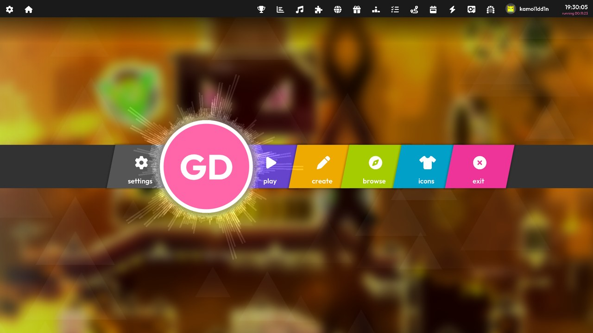
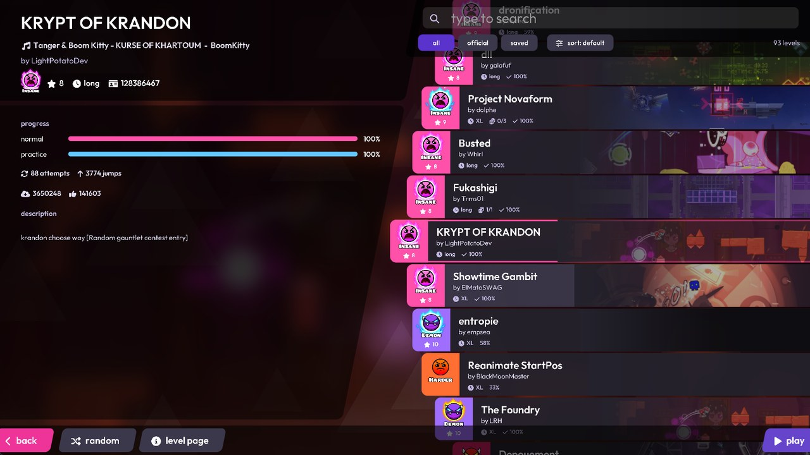
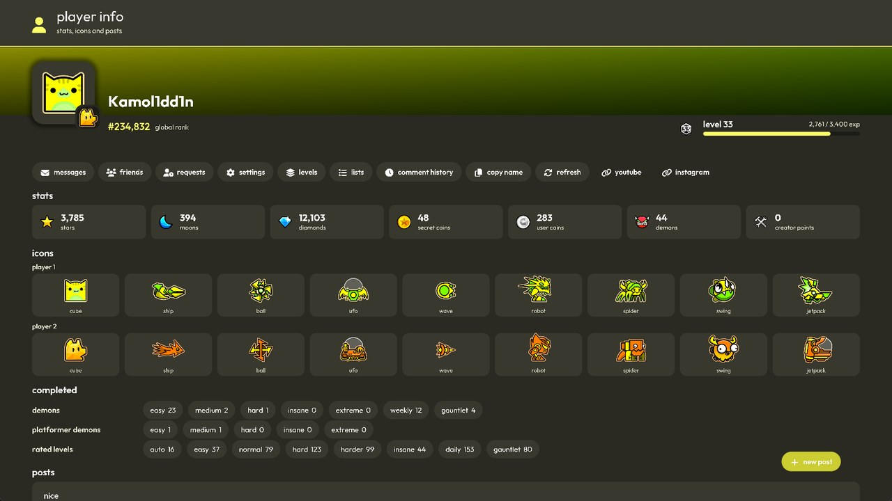
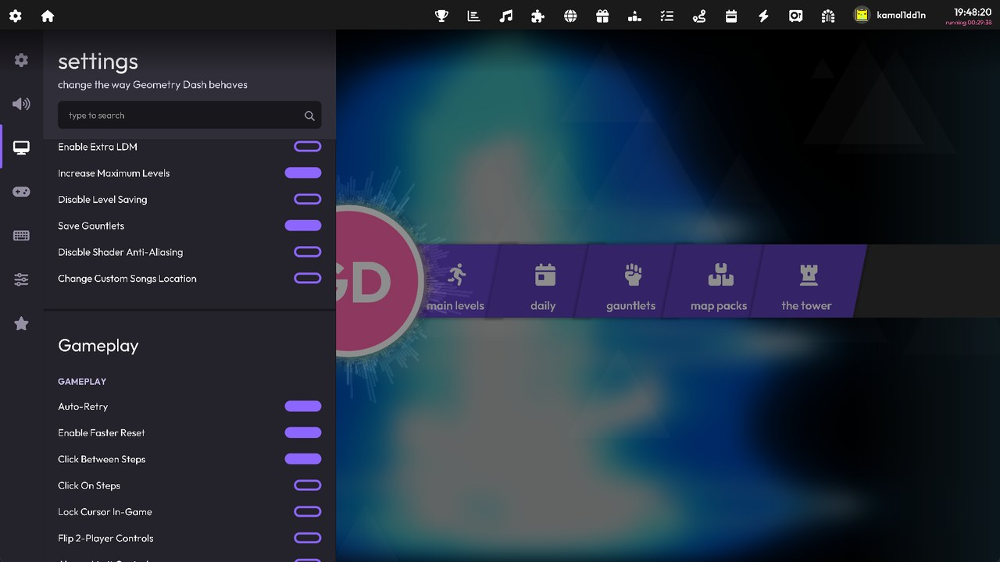

# Lazer UI

> [!IMPORTANT]
> **It is not intended for Geode's official mod index, and never will be.** Please do not submit it there or ask for it to be added.
>
> Builds come from this repo's source through GitHub Actions: grab the `.geode` from [Releases](https://github.com/kamol1dn/GD-lazer/releases) or the latest [Actions](https://github.com/kamol1dn/GD-lazer/actions) run. They aren't reviewed by Geode, so install manually and at your own risk.
>
> **How to install, step by step for Windows, Android and macOS: [INSTALL.md](INSTALL.md).**

## An apology

I submitted an early version of this mod to the Geode index as a local build, without knowing how the process works. That was my mistake, and I'm sorry to the Geode reviewers for the extra work it caused. The listing has been taken down, and this mod will stay off the index.

I also understand the concern about how closely it follows osu!lazer's design. Credit for that design belongs to ppy and the osu! team.

## About

A Geode mod that rebuilds Geometry Dash's menus in the style of osu!lazer: a music-reactive main menu, a song-select screen for your levels, map packs and online lists, a page for every level, full-screen overlays for settings, chests, achievements, paths and more, an osu!-style pause menu, and an intro and outro, all animated and with sounds.

Lazer UI is a personal project, developed with heavy use of AI coding tools.

> [!WARNING]
> **Alpha version, for testing.** Lazer UI is early and under active development, and it is **prone to crashes**. It hooks deep into GD's menus, so expect bugs, crashes and unfinished screens, especially alongside other menu mods. Back up your save (or use cloud save) before trying it, and please report crashes with the crash log.

It replaces GD's menus, not its gameplay. GD's own screens and handlers still run underneath, so progress, saving, account features and other mods keep working.

> Not affiliated with or endorsed by ppy or osu!. Animation behaviour is adapted from the MIT-licensed [osu!](https://github.com/ppy/osu) and [osu-framework](https://github.com/ppy/osu-framework) source code.

## Screenshots



| | |
|---|---|
|  |  |
| Song select | Browsing online (featured) |
|  |  |
| Level page | Pause menu |
|  |  |
| Paths | Profile |
|  | |
| Settings | |

## Platforms

Windows, Android and macOS (Apple Silicon and Intel), all for GD 2.2081 and Geode 5.10.1. Installing on each: [INSTALL.md](INSTALL.md). Every Actions run builds all three into one `.geode`. The osu! cursor is Windows-only; phones get tilt parallax instead of the mouse one. On macOS, Lazer's graphics and parental dialogs fall back to GD's own for now.

## Features

**Main menu**
- Pulsing logo with an audio visualiser, beat-synced side flashes and drifting triangles
- Button bar with **play**, **create** and **browse** submenus in place of GD's creator hub:
  - play: classic, platformer, daily, weekly, event
  - create: my levels, my lists
  - browse: search, featured, lists, hall of fame, magic, recent (and sent, for moderators)
- Toolbar with every vanilla and mod menu button: gauntlets and map packs on the left; achievements, statistics, leaderboards, quests, paths, chests, vault, treasure room, the music player and mods on the right. Other mods' creator hub buttons move here too
- Blurred, parallax background that crossfades to the playing level's thumbnail

**Music player**
- The menu plays the downloaded songs of your saved levels instead of the menu loop
- Now-playing card with previous / play / next / shuffle, a seek bar and a song ticker
- Block songs you never want to hear (sound-effect packs and the like); tracks under 30 s are skipped
- With Ventilla installed, its live radio can be the menu's music instead

**Song select**
- Your saved levels and RobTop's in one curved carousel, with search, folders, groups and sorting; classic and platformer levels are separate lists
- The selected level's details on the left: progress, description, song, options, comments and leaderboard. Its song previews and its thumbnail becomes the background
- Map packs open here too: a pack's row unfolds into its levels
- Online lists are the same screen: search, featured, lists, hall of fame, magic, recent and sent load a page at a time as you scroll, with a sort, GD's filters, a pager and refresh. Lists unfold into their levels, and other mods' search-screen buttons sit beside the controls

**Level page**
- A level opens on its own page instead of GD's: its picture, rating, difficulty, stars, coins, song, downloads and likes, then play, heart, like, comments, add to list, copy the ID and the song's download
- Below: the description, details, your progress and its scores (top, this week or friends). GD's own page is one tap away

**Your levels and lists (create)**
- My levels and my lists open as pages of cards with the song, length, object count and whether each is verified or uploaded, a search box, GD's folders, a new level / new list button and your uploaded levels

**Overlays**
- Searchable settings covering GD's options and the mod's own, including account actions (save, load, refresh login, unlink)
- Daily chests, quests, achievements, statistics, leaderboards (top 100, friends, global, creators), friends (search players by name or ID, browse your friends, open their profiles) and paths (every path's ranks and rewards; unlock, activate and claim)
- Account card and a redesigned profile page for any player
- GD's shops as osu!-style pages; buying goes through GD's own popup, and the shopkeeper still talks
- A level's comments: newest or top, posting and voting, the writer's profile one tap away
- GD's popups restyled to match

**Pause and level complete** (off by default: turn on "Lazer pause and results")
- osu!'s pause menu: continue, retry and practice, your progress and the retry count, music and effects volume, quit, options and other mods' pause buttons
- An osu!-style results screen when you finish a level, with your attempts, jumps and time, a "new best" badge, GD's rewards and coins, and other mods' end-screen buttons

**Startup and exit**
- Black loading screen with a spinner, then an animated intro while the first song fades in; an outro when quitting

**Cursor and sound**
- osu!'s menu cursor on Windows. It shows exactly when the system cursor would, so it stays out of gameplay and behaves with other mods' menus
- Hover and click sounds on every control, with their own volume setting

**Updates**
- Not on the Geode index, so the mod updates itself: on start it checks the version on GitHub's main branch and offers to download and install the new release (Lazer settings > Updates)

## Optional integrations

None of these are required. The matching extras appear when a mod is installed.

| Mod | Adds |
|---|---|
| Level Thumbnails (`cdc.level_thumbnails`) | Level thumbnails for backgrounds, song select and the level page |
| Separate Dual Icons (`weebify.separate_dual_icons`) | Player 2 icons on the account card and your profile |
| Better Progression (`itzkiba.better_progression`) | Level badge and EXP bar |
| Ventilla (`joseii.ventilla`) | Its live radio as the menu's music, with its options in Settings > Audio |
| Globed (`dankmeme.globed2`) | A proper "multiplayer" toolbar button |

[Image Plus](https://github.com/Prevter/ImagePlus) (`prevter.imageplus`, to decode the WebP thumbnails) and Custom Keybinds (`geode.custom-keybinds`) are required.

## How it works

- **`early-load`** is set so the mod can restyle GD's loading screen from its first frame. Nothing else runs early. At that point the mod's own resources aren't loaded yet, so the loading screen is drawn entirely in code.
- **GD layers run hidden.** The pages drive GD's own layers (LevelInfoLayer, LevelBrowserLayer, RewardsPage, ProfilePage, GJShopLayer, CreatorLayer...) kept hidden and non-interactive, and press their real buttons. GD's logic, networking and saving are never reimplemented.
- **Networking:** level thumbnails, fetched from the Level Thumbnails community server (`levelthumbs.prevter.me`) and cached on disk, and the update check: `mod.json` and `changelog.md` from this repo's `main` branch, plus the GitHub release when you choose to update. The download is checked to be this mod, at that version, for your platform, GD and Geode, before it replaces the installed one. No accounts, analytics or other requests.
- **The background blur** captures GD's scene or the level image at a quarter of the screen, blurs it there in two passes and upscales the result. A settled level image keeps its blur instead of redoing it every frame.
- **Settings:** everything can be switched off. `enabled` turns the whole mod off; the intro and outro, music player, popup restyle, profile restyle, pause and results restyle, background dim, blur, triangles, parallax and cursor each have their own setting.

## Source layout

```
src/
  audio/              UI sounds, menu music player, audio analysis (beats, spectrum)
  levels/             level library, map packs and online lists for song select
  integrations/       level thumbnails, Ventilla, optional mod integrations
  settings/           settings content, account actions, GD option mapping
  ui/core/            shared building blocks: easing, text, rounded boxes, scroll areas, cursor
  ui/menu/            main menu: logo, button system, background, toolbar, music card, account card
  ui/overlays/        full-screen pages (level page, comments, paths, shops...), pause, results, popups
  ui/select/          song select, for saved, map pack and online levels
  ui/startup/         loading screen and intro
  update/             self-updater (GitHub releases)
tools/                icon font generator, Android install script
```

## Credits

- UI sounds from [osu-resources](https://github.com/ppy/osu-resources) by ppy Pty Ltd, [CC-BY-NC 4.0](https://creativecommons.org/licenses/by-nc/4.0/), converted to Ogg Vorbis. The intro uses the opening of osu!'s "triangles" theme by cYsmix and the outro osu!'s "see you next time" line, from the same repository. This is why the mod must stay free.
- Bug fixes, the macOS port, and additional features by [souply](https://github.com/souplyy).
- Motion and layout adapted from [osu!](https://github.com/ppy/osu) and [osu-framework](https://github.com/ppy/osu-framework) (MIT).
- Font: [Outfit](https://github.com/Outfitio/Outfit-Fonts) (SIL Open Font License).
- Icons: [Font Awesome Free](https://fontawesome.com/) (solid; icons CC BY 4.0, font SIL OFL).
- Screenshots of RobTop's levels (song select) from the [Geometry Dash Wiki](https://geometry-dash.fandom.com/) level pages, resized to 640×360. The levels themselves are RobTop Games'.
